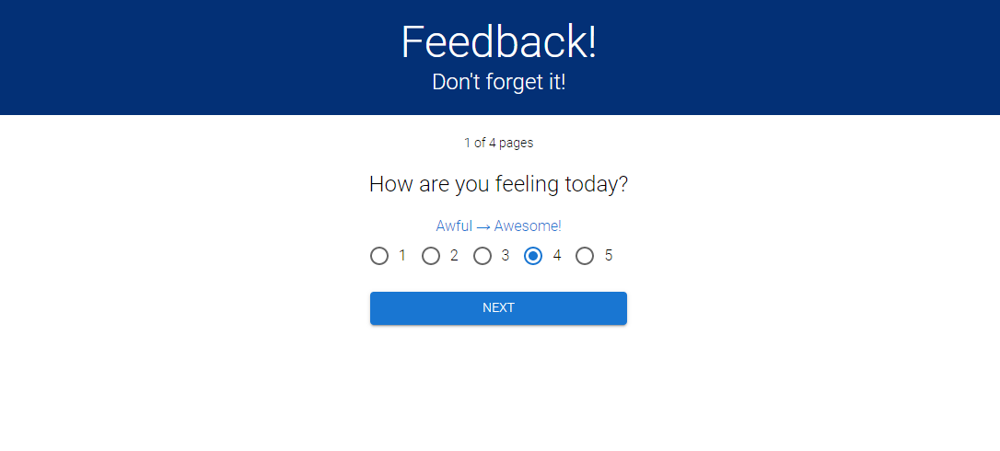

# Weekend Redux Feedback Loop

## Description

_Duration: 3 Day Sprint_

This is a feedback survey where a user can input how they are feeling over multiple pages. Full stack program with React, Redux, and Postgresql.

### Visit: https://hess-redux-feedback-loop.herokuapp.com/#/

## Checklist
See: https://github.com/hesscm/weekend-redux-feedback-loop/wiki/Checklist

## Screen Shot

### Prerequisites

- Any IDE such as VS Code or a web browser, NPM, postgresql and associated database software.

## Installation
1. Fork the repository
2. Ensure that [git is installed](https://git-scm.com/downloads) on your Mac/PC.
2. Copy the SSH link under 'Code'.
3. Enter terminal(Mac) or Git Bash(Windows) and in your desired folder, type 'git clone git@github.com:hesscm/weekend-redux-feedback-loop.git'.
4. Open with your preferred IDE.
5. You will need node.js installed. In the repo folder, type "npm install" to install all of the included dependencies.
6. Install a database with the data in the data.sql file.
7. Type "npm run server" to get the server running.
8. Open a new terminal and type "npm run client" to get the react client going.
9. Run the app in the browser at "localhost:3000".

## Usage

1. Click the buttons to navigate from page to page.
2. Every radio field is required for submission.
3. The comments are an optional input.
4. You may hit back in your browser to go and adjust an input before submission.
5. SECRET WEBPAGE! '/admin' shows all of the feedback added to the database. Each entry can be deleted.

## Built With

HTML, CSS, JavaScript, React, Redux, Axios, Material-UI, node.js(with express, moment, and pg)

## Acknowledgement
Thanks to [Prime Digital Academy](www.primeacademy.io) who equipped and helped me to make this application a reality. (Shout out to Chris Black!)

## Support
If you have suggestions or issues, please email me at [chrishessmusic@gmail.com]